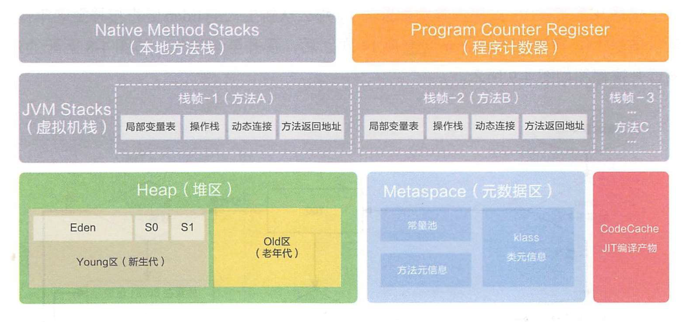
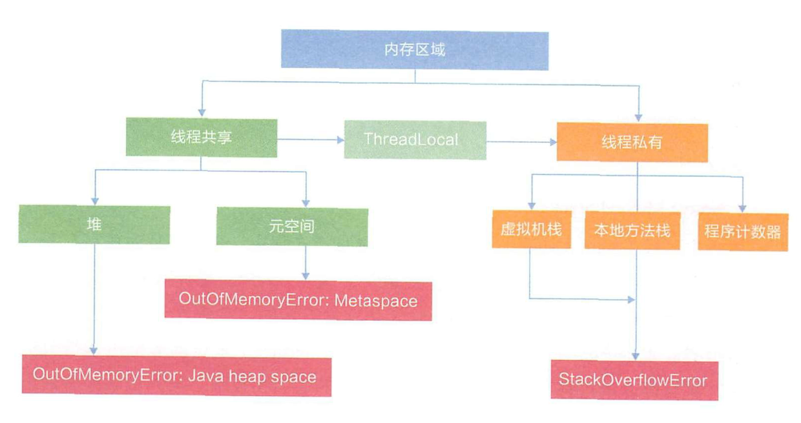

# java虚拟机

屏蔽底层操作系统平台的不同并且减少基于原生语言开发的复杂性，使java能够跨各种平台

在机器和编译程序之间加入了一层抽象的虚拟机器。这台虚拟的机器在任何平台上都提供给编译程序一个的共同的接口。编译程序只需要面向虚拟机，生成虚拟机能够理解的代码，然后由解释器来将虚拟机代码转换为特定系统的机器码执行。在Java中，这种供虚拟机理解的代码叫做字节码（即扩展为.class的文件），它不面向任何特定的处理器，只面向虚拟机。每一种平台的解释器是不同的，但是实现的虚拟机是相同的。Java源程序经过编译器编译后变成字节码，字节码由虚拟机解释执行，虚拟机将每一条要执行的字节码送给解释器，解释器将其翻译成特定机器上的机器码，然后在特定的机器上运行，这就是上面提到的Java的特点的编译与解释并存的解释。

# Java内存区域

## JVM 的主要组成部分及其作用

两个子系统和两个组件：

- Class loader(类装载)：根据给定的全限定名类名(如：java.lang.Object)来装载class文件到Runtime data area中的method area。

- Execution engine（执行引擎）：执行classes中的指令。

- Native Interface(本地接口)：与native libraries交互，是其它编程语言交互的接口。

- Runtime data area(运行时数据区域)：这就是我们常说的JVM的内存。

作用 ：首先通过编译器把 Java 代码转换成字节码，类加载器（ClassLoader）再把字节码加载到内存中，将其放在运行时数据区（Runtime data area）的方法区内，而字节码文件只是 JVM 的一套指令集规范，并不能直接交给底层操作系统去执行，因此需要特定的命令解析器执行引擎（Execution Engine），将字节码翻译成底层系统指令，再交由 CPU 去执行，而这个过程中需要调用其他语言的本地库接口（Native Interface）来实现整个程序的功能。

## Java程序运行机制步骤

首先利用IDE集成开发工具编写Java源代码，源文件的后缀为.java；

再利用编译器(javac命令)将源代码编译成字节码文件，字节码文件的后缀名为.class；

运行字节码的工作是由解释器(java命令)来完成的。

##  JVM 运行时数据区

- 程序计数器（Program Counter Register）：当前线程所执行的字节码的行号指示器，字节码解析器的工作是通过改变这个计数器的值，来选取下一条需要执行的字节码指令，分支、循环、跳转、异常处理、线程恢复等基础功能，都需要依赖这个计数器来完成；

- Java 虚拟机栈（Java Virtual Machine Stacks）：用于存储局部变量表、操作数栈、动态链接、方法出口等信息；

- 本地方法栈（Native Method Stack）：与虚拟机栈的作用是一样的，只不过虚拟机栈是服务 Java 方法的，而本地方法栈是为虚拟机调用 Native 方法服务的；

- Java 堆（Java Heap）：Java 虚拟机中内存最大的一块，是被所有线程共享的，几乎所有的对象实例都在这里分配内存；通过new关键字和构造器创建的对象

- 方法区（Methed Area）：用于存储已被虚拟机加载的类信息、常量、静态变量、即时编译后的代码等数据。JDK8 之前，Hotspot 中方法区的实现是永久代（Perm），JDK8 开始使用元空间（Metaspace），以前永久代所有内容的字符串常量移至堆内存，其他内容移至元空间，元空间直接在本地内存分配。

## 深拷贝和浅拷贝

浅拷贝（shallowCopy）只是增加了一个指针指向已存在的内存地址，

深拷贝（deepCopy）是增加了一个指针并且申请了一个新的内存，使这个增加的指针指向这个新的内存，

使用深拷贝的情况下，释放内存的时候不会因为出现浅拷贝时释放同一个内存的错误。

浅复制：仅仅是指向被复制的内存地址，如果原地址发生改变，那么浅复制出来的对象也会相应的改变。

深复制：在计算机中开辟一块新的内存地址用于存放复制的对象。

## 说一下堆栈的区别？

物理地址

堆的物理地址分配对对象是不连续的。因此性能慢些。

栈物理地址分配是连续的。所以性能快。

内存分别

堆因为是不连续的，所以分配的内存是在运行期确认的，因此大小不固定。一般堆大小远远大于栈。

栈是连续的，所以分配的内存大小要在编译期就确认，大小是固定的。

存放的内容

堆存放的是对象的实例和数组。因此该区更关注的是数据的存储

栈存放：局部变量，操作数栈，返回结果。该区更关注的是程序方法的执行。

PS：

1. 静态变量放在方法区

2. 静态的对象还是放在堆。

程序的可见度

堆对于整个应用程序都是共享、可见的。

栈只对于线程是可见的。所以也是线程私有。他的生命周期和线程相同。

# HotSpot虚拟机对象探秘

## 对象的创建

1. 虚拟机遇到一条new指令时，先检查常量池是否已经加载相应的类，如果没有，必须先执行相应的类加载。

2. 类加载通过后，接下来分配内存。

3. 划分内存时还需要考虑一个问题-并发，也有两种方式: CAS同步处理，或者本地线程分配缓冲(Thread Local Allocation Buffer, TLAB)。

4. 然后内存空间初始化操作，接着是做一些必要的对象设置(元信息、哈希码…)，最后执行<init>方法。

## 为对象分配内存

类加载完成后，接着会在Java堆中划分一块内存分配给对象。内存分配根据Java堆是否规整，有两种方式：

- 指针碰撞：如果Java堆的内存是规整，即所有用过的内存放在一边，而空闲的的放在另一边。分配内存时将位于中间的指针指示器向空闲的内存移动一段与对象大小相等的距离，这样便完成分配内存工作。

- 空闲列表：如果Java堆的内存不是规整的，则需要由虚拟机维护一个列表来记录那些内存是可用的，这样在分配的时候可以从列表中查询到足够大的内存分配给对象，并在分配后更新列表记录。

选择哪种分配方式是由 Java 堆是否规整来决定的，而 Java 堆是否规整又由所采用的垃圾收集器是否带有压缩整理功能决定。

## 处理并发安全问题

对象的创建在虚拟机中是一个非常频繁的行为，哪怕只是修改一个指针所指向的位置，在并发情况下也是不安全的，可能出现正在给对象 A 分配内存，指针还没来得及修改，对象 B 又同时使用了原来的指针来分配内存的情况。解决这个问题有两种方案：

- 对分配内存空间的动作进行同步处理（采用 CAS + 失败重试来保障更新操作的原子性）；

- 本地线程分配缓冲（Thread Local Allocation Buffer, TLAB）:把内存分配的动作按照线程划分在不同的空间之中进行，即每个线程在 Java 堆中预先分配一小块内存，。哪个线程要分配内存，就在哪个线程的 TLAB 上分配。只有 TLAB 用完并分配新的 TLAB 时，才需要同步锁。通过-XX:+/-UserTLAB参数来设定虚拟机是否使用TLAB。

## 对象的访问定位

Java程序需要通过 JVM 栈上的引用访问堆中的具体对象。对象的访问方式取决于 JVM 虚拟机的实现。目前主流的访问方式有 句柄 和 直接指针 两种方式。

指针： 指向对象，代表一个对象在内存中的起始地址。

句柄： 可以理解为指向指针的指针，维护着对象的指针。句柄不直接指向对象，而是指向对象的指针（句柄不发生变化，指向固定内存地址），再由对象的指针指向对象的真实内存地址。

- 句柄访问

`Java`堆中划分出一块内存来作为**句柄池**，引用中存储对象的**句柄地址**，而句柄中包含了**对象实例数据**与**对象类型数据**各自的**具体地址**信息：

引用中存储的是**稳定**的句柄地址，在对象被移动（垃圾收集时移动对象是非常普遍的行为）时只会改变**句柄中**的**实例数据指针**，而**引用**本身不需要修改。

- 直接指针

如果使用**直接指针**访问，**引用** 中存储的直接就是**对象地址**，那么`Java`堆对象内部的布局中就必须考虑如何放置访问**类型数据**的相关信息。

**优势**：速度更**快**，节省了**一次指针定位**的时间开销。由于对象的访问在`Java`中非常频繁，因此这类开销积少成多后也是非常可观的执行成本。HotSpot 中采用的就是这种方式。

#  垃圾收集器

## Java垃圾回收机制

简单的说就是内存中已经不再被使用到的空间就是垃圾

java中，程序员是不需要显示的去释放一个对象的内存的，而是由虚拟机自行执行。

内存泄漏是指不再被使用的对象或者变量一直被占据在内存中。

理论上来说，Java是有GC垃圾回收机制的，也就是说，不再被使用的对象，会被GC自动回收掉，自动从内存中清除。

由于有这个垃圾回收机制，java中的对象不再有“作用域”的概念，只有引用的对象才有“作用域”。

垃圾回收器通常作为一个单独的低级别的线程运行，在不可预知的情况下对内存堆中已经死亡的或很长时间没有用过的对象进行清除和回收。

程序员不能实时的对某个对象或所有对象调用垃圾回收器进行垃圾回收。

GC 是垃圾收集的意思（Gabage Collection）,

## Java 中都有哪些引用类型？

- 强引用：无论如何都不会被回收的对象，发生 gc 的时候不会被回收。

- 软引用：在内存不足时会被回收。SoftReference类

- 弱引用：有用但不是必须的对象，在下一次GC时会被回收。weakReakReference，需要读取大量的本地图片，每次读图片都会影响性能，一次性全部加载又会造成内存溢出，所以使用软引用或者弱引用，，weakHashMap用来做缓存当发生gc时回收

- 虚引用（幽灵引用/幻影引用）：无法通过虚引用获得对象，用 PhantomReference 实现虚引用，虚引用的用途是在 gc 时返回一个通知。配合引用队列使用，ReferenceQueue

## 怎么判断对象是否可以被回收？

垃圾收集器在做垃圾回收的时候，首先需要判定的就是哪些内存是需要被回收的，哪些对象是「存活」的，是不可以被回收的；哪些对象已经「死掉」了，需要被回收。

一般有两种方法来判断：

- 引用计数器法：java不使用此方法。为每个对象创建一个引用计数，有对象引用时计数器 +1，引用被释放时计数 -1，当计数器为 0 时就可以被回收。它有一个缺点不能解决循环引用的问题；

- 可达性分析算法：从 GC Roots 开始向下搜索，搜索所走过的路径称为引用链。当一个对象到 GC Roots 没有任何引用链相连时，则证明此对象是可以被回收的。

GCRoot对象：

1. 虚拟机栈中引用的对象（局部变量区）
2. 方法区中类静态属性引用的对象
3. 方法区中常量引用的对象
4. 本地方法栈中JNI （Natice方法）引用的对象

##  JVM 的垃圾回收算法

- 引用计数，java不使用此方法
- 标记-清除算法：标记无用对象，然后进行清除回收。缺点：效率不高，无法清除垃圾碎片。
- 复制算法：按照容量划分二个大小相等的内存区域，当一块用完的时候将活着的对象复制到另一块上，然后再把已使用的内存空间一次清理掉。缺点：内存使用率不高，只有原来的一半。
- 标记-整理算法：标记无用对象，让所有存活的对象都向一端移动，然后直接清除掉端边界以外的内存。
- 分代算法：根据对象存活周期的不同将内存划分为几块，一般是新生代和老年代，新生代基本采用复制算法，老年代采用标记整理算法。

> 标记-清除算法

标记无用对象，然后进行清除回收。

标记-清除算法（Mark-Sweep）是一种常见的基础垃圾收集算法，它将垃圾收集分为两个阶段：

标记阶段：标记出可以回收的对象。

清除阶段：回收被标记的对象所占用的空间。

标记-清除算法之所以是基础的，是因为后面讲到的垃圾收集算法都是在此算法的基础上进行改进的。

优点：实现简单，不需要对象进行移动。

缺点：标记、清除过程效率低，产生大量不连续的内存碎片，提高了垃圾回收的频率。

> 复制算法

为了解决标记-清除算法的效率不高的问题，产生了复制算法。它把内存空间划为两个相等的区域，每次只使用其中一个区域。垃圾收集时，遍历当前使用的区域，把存活对象复制到另外一个区域中，最后将当前使用的区域的可回收的对象进行回收。

优点：按顺序分配内存即可，实现简单、运行高效，不用考虑内存碎片。

缺点：可用的内存大小缩小为原来的一半，对象存活率高时会频繁进行复制。

> 标记-整理算法

在新生代中可以使用复制算法，但是在老年代就不能选择复制算法了，因为老年代的对象存活率会较高，这样会有较多的复制操作，导致效率变低。标记-清除算法可以应用在老年代中，但是它效率不高，在内存回收后容易产生大量内存碎片。因此就出现了一种标记-整理算法（Mark-Compact）算法，与标记-整理算法不同的是，在标记可回收的对象后将所有存活的对象压缩到内存的一端，使他们紧凑的排列在一起，然后对端边界以外的内存进行回收。回收后，已用和未用的内存都各自一边。

优点：解决了标记-清理算法存在的内存碎片问题。

缺点：仍需要进行局部对象移动，一定程度上降低了效率。

> 分代收集算法

当前商业虚拟机都采用**分代收集**的垃圾收集算法。分代收集算法，顾名思义是根据对象的**存活周期**将内存划分为几块。一般包括**年轻代**、**老年代** 和 **永久代**

永久代是HotSpot的概念，方法区是Java虚拟机规范中的定义，是一种规范，而永久代是一种实现，一个是标准一个是实现。

- 伊甸园（Eden）：这是对象最初诞生的区域，并且对大多数对象来说，这里是它们唯一存在过的区域。

- 幸存者乐园（Survivor）：从伊甸园幸存下来的对象会被挪到这里。

- 终身颐养园（Tenured）：这是足够老的幸存对象的归宿。年轻代收集（Minor-GC）过程是不会触及这个地方的。当年轻代收集不能把对象放进终身颐养园时，就会触发一次完全收集（Major-GC），这里可能还会牵扯到压缩，以便为大对象腾出足够的空间。

## JVM 有哪些垃圾回收器？

Serial收集器（复制算法): 新生代单线程收集器，标记和清理都是单线程，优点是简单高效；

ParNew收集器 (复制算法): 新生代收并行集器，实际上是Serial收集器的多线程版本，在多核CPU环境下有着比Serial更好的表现；

Parallel Scavenge收集器 (复制算法): 新生代并行收集器，追求高吞吐量，高效利用 CPU。吞吐量 = 用户线程时间/(用户线程时间+GC线程时间)，高吞吐量可以高效率的利用CPU时间，尽快完成程序的运算任务，适合后台应用等对交互相应要求不高的场景；

Serial Old收集器 (标记-整理算法): 老年代单线程收集器，Serial收集器的老年代版本；

Parallel Old收集器 (标记-整理算法)： 老年代并行收集器，吞吐量优先，Parallel Scavenge收集器的老年代版本；

CMS(Concurrent Mark Sweep)收集器（标记-清除算法）并发清除GC： 老年代并行收集器，以获取最短回收停顿时间为目标的收集器，具有高并发、低停顿的特点，追求最短GC回收停顿时间。

G1(Garbage First)收集器 (标记-整理算法)： Java堆并行收集器，G1收集器是JDK1.7提供的一个新收集器，G1收集器基于“标记-整理”算法实现，也就是说不会产生内存碎片。此外，G1收集器不同于之前的收集器的一个重要特点是：G1回收的范围是整个Java堆(包括新生代，老年代)，而前六种收集器回收的范围仅限于新生代或老年代。在停顿时间上加入预测机制。

内存区域不再是连续的，而是变成一个个大小一样的region，每个region1M到32M不等，还是分代收集器，逻辑上的分代概念

工作过程：

针对eden进行收集，数据移动到survivor区

## 简述分代垃圾回收器是怎么工作的？

分代回收器有两个分区：老生代和新生代，新生代默认的空间占比总空间的 1/3，老生代的默认占比是 2/3。

新生代使用的是复制算法，新生代里有 3 个分区：Eden、To Survivor、From Survivor，它们的默认占比是 8:1:1，它的执行流程如下：

- 把 Eden + From Survivor 存活的对象放入 To Survivor 区；

- 清空 Eden 和 From Survivor 分区；

- From Survivor 和 To Survivor 分区交换，From Survivor 变 To Survivor，To Survivor 变 From Survivor。

每次在 From Survivor 到 To Survivor 移动时都存活的对象，年龄就 +1，当年龄到达 15（默认配置是 15）时，升级为老生代。大对象也会直接进入老生代。

老生代当空间占用到达某个值之后就会触发全局垃圾收回，一般使用标记整理的执行算法。以上这些循环往复就构成了整个分代垃圾回收的整体执行流程。

# 内存分配策略

## 对象优先在 Eden 区分配

多数情况，对象都在新生代 Eden 区分配。当 Eden 区分配没有足够的空间进行分配时，虚拟机将会发起一次 Minor GC。如果本次 GC 后还是没有足够的空间，则将启用分配担保机制在老年代中分配内存。

这里我们提到 Minor GC，如果你仔细观察过 GC 日常，通常我们还能从日志中发现 Major GC/Full GC。

Minor GC 是指发生在新生代的 GC，因为 Java 对象大多都是朝生夕死，所有 Minor GC 非常频繁，一般回收速度也非常快；

Major GC/Full GC 是指发生在老年代的 GC，出现了 Major GC 通常会伴随至少一次 Minor GC。Major GC 的速度通常会比 Minor GC 慢 10 倍以上。

## 大对象直接进入老年代

所谓大对象是指需要大量连续内存空间的对象，频繁出现大对象是致命的，会导致在内存还有不少空间的情况下提前触发 GC 以获取足够的连续空间来安置新对象。

前面我们介绍过新生代使用的是标记-清除算法来处理垃圾回收的，如果大对象直接在新生代分配就会导致 Eden 区和两个 Survivor 区之间发生大量的内存复制。因此对于大对象都会直接在老年代进行分配。

## 长期存活对象将进入老年代

虚拟机采用分代收集的思想来管理内存，那么内存回收时就必须判断哪些对象应该放在新生代，哪些对象应该放在老年代。因此虚拟机给每个对象定义了一个对象年龄的计数器，如果对象在 Eden 区出生，并且能够被 Survivor 容纳，将被移动到 Survivor 空间中，这时设置对象年龄为 1。对象在 Survivor 区中每「熬过」一次 Minor GC 年龄就加 1，当年龄达到一定程度（默认 15） 就会被晋升到老年代。

# 虚拟机类加载机制
虚拟机把描述类的数据从Class文件加载到内存，并对数据进行校验，解析和初始化，最终形成可以被虚拟机直接使用的java类型。

## 描述一下JVM加载Class文件的原理机制
   Java中的所有类，都需要由类加载器装载到JVM中才能运行。类加载器本身也是一个类，而它的工作就是把class文件从硬盘读取到内存中。在写程序的时候，我们几乎不需要关心类的加载，因为这些都是隐式装载的，除非我们有特殊的用法，像是反射，就需要显式的加载所需要的类。

   类装载方式，有两种 ：

   1.隐式装载， 程序在运行过程中当碰到通过new 等方式生成对象时，隐式调用类装载器加载对应的类到jvm中，

   2.显式装载， 通过class.forname()等方法，显式加载需要的类

   Java类的加载是动态的，它并不会一次性将所有类全部加载后再运行，而是保证程序运行的基础类(像是基类)完全加载到jvm中，至于其他类，则在需要的时候才加载。这当然就是为了节省内存开销。

## 什么是类加载器，类加载器有哪些?
   实现通过类的权限定名获取该类的二进制字节流的代码块叫做类加载器。

   主要有一下四种类加载器:

-   启动类加载器(Bootstrap ClassLoader)用来加载java核心类库，无法被java程序直接引用。是虚拟机自身的一部分，用来加载Java_HOME/lib/目录中的，或者被 -Xbootclasspath 参数所指定的路径中并且被虚拟机识别的类库；
-   扩展类加载器(extensions class loader):它用来加载 Java 的扩展库。Java 虚拟机的实现会提供一个扩展库目录。该类加载器在此目录里面查找并加载 Java 类。
-   系统类加载器（system class loader）：它根据 Java 应用的类路径（CLASSPATH）来加载 Java 类。一般来说，Java 应用的类都是由它来完成加载的。可以通过 ClassLoader.getSystemClassLoader()来获取它。
-   用户自定义类加载器，通过继承 java.lang.ClassLoader类的方式实现。

## 说一下类装载的执行过程？
   类装载分为以下 5 个步骤：

   - 加载：根据查找路径找到相应的 class 文件然后导入；
   - 验证：检查加载的 class 文件的正确性；
   - 准备：给类中的静态变量分配内存空间；
   - 解析：虚拟机将常量池中的符号引用替换成直接引用的过程。符号引用就理解为一个标示，而在直接引用直接指向内存中的地址；
   - 初始化：对静态变量和静态代码块执行初始化工作。

## 什么是双亲委派模型？
   在介绍双亲委派模型之前先说下类加载器。对于任意一个类，都需要由加载它的类加载器和这个类本身一同确立在 JVM 中的唯一性，每一个类加载器，都有一个独立的类名称空间。类加载器就是根据指定全限定名称将 class 文件加载到 JVM 内存，然后再转化为 class 对象。

   双亲委派模型：如果一个类加载器收到了类加载的请求，它首先不会自己去加载这个类，而是把这个请求委派给父类加载器去完成，每一层的类加载器都是如此，这样所有的加载请求都会被传送到顶层的启动类加载器中，只有当父加载无法完成加载请求（它的搜索范围中没找到所需的类）时，子加载器才会尝试去加载类。

# JVM调优
## OOM的常见异常

- Java.lang.StackOverflowError
- Java.lang.OutOfMemoryError:Java heap space
- Java.lang.OutOfMemeoryError:GC overhead limit exceeded
- Java.lang.OutOfMemeoryError:Direct buffer memory
- Java.lang.OutOfMemeoryError:unable to create new native thread
- Java.lang.OutOfMemeoryError:Metaspace

##  JVM 调优的java工具？

   JDK 自带了很多监控工具，都位于 JDK 的 bin 目录下，其中最常用的是 jconsole 和 jvisualvm 这两款视图监控工具。

- jconsole：用于对 JVM 中的内存、线程和类等进行监控；

- jvisualvm：JDK 自带的全能分析工具，可以分析：内存快照、线程快照、程序死锁、监控内存的变化、gc 变化等。

- jstack  全称： JVM Stack Trance  作用： 查看某个java进程的堆栈情况， 可用于确认死锁、IO等待、死循环等问题。

-  jstat   作用：   查看进程中内存使用情况，但只能给出一些简单统计数据   
    - 统计加载了多少类以及占用空间 jstat -class pid
    - 统计编译了多少文件 jstat -compiler 10
    
- jmap  全称： JVM Memory Map  作用：生成进程的内存堆快照   当需要看一下进程里是什么东西占用了过多内存时， 可以用jmap打印一下堆快照。
    - 打印堆快照： jmap -dump:file=./dumpfile.dump 进程pid
    - 查看特定类所占用的情况： jmap -histo:live 进程pid | grep 类名
    
- jhat  全称： JVM Heap Analysis Tool  和jmap配合， 可以解析jmap生成的堆快照， 支持生成1个web进程供我们分析和查看。
    - jhat -J-Xmx515M dumpfile.dump
    此时就会启动1个webServer，然后我们去访问就行了

- jdb   全称：Java Debugger    作用：用来对core文件和正在运行的Java进程进行实时地调试，类似于c++里的gdb
    - 启动进程并调试: jdb -classpath . Test
    - 至二级调试某进程: jdb -attach 8000 -sourcepath /Users/wefit/Development/study/java/jtest/src/

- jcmd  作用：多功能的工具，可以用它来导出堆、查看Java进程、导出线程信息、执行GC、还可以进行采样分析，可以理解为1个性能调优时用的工具。

    - 查看 当前机器上所有的 jvm 进程信息: jcmd -l
    - 查看指定进程的性能统计信息: jcmd pid PerfCounter.print
    - 列出当前运行的 java 进程可以执行的操作: jcmd PID help
    - 查看线程堆栈信息: jcmd PID Thread.print
    - 查看堆内存信息： jcmd PID GC.heap_dump FILE_NAME

- jps   简单记法： JVM process status    全名：Java Virtual Machine Process Status Tool 作用： 显示 ***当前系统用户*** 的 ***所有*** Java进程情况及其进程号
    - 查看进程jvm参数： jps -v
    - 输出程序main class的完整package名或程序的jar文件完整路径名： jps -l
    - 输出传递给main方法的参数: jps -m

- jinfo   jvm infomation    作用：和jps功能类似， 但是支持根据指定pis查看指定进程
  
    - 可以查看JVM参数、系统参数、调整jvm参数
    
- 但不支持查看java程序的内存使用情况
  
      jinfo -flag xxx	查看xxx参数
  
- javap 把java字节码文件反汇编为Java源码文件。

## jvm参数类型

- 标配参数

  -version、-help、-showversion

- X参数

  -Xint：解释执行、 -Xcomp： 第一次使用就编译成本地代码、-Xmixed：混合模式

- XX参数

  Boolean类型和KV设值类型

  

  

## 常用的 JVM 调优的参数都有哪些？
   - -Xms2g：初始化推大小为 2g；等价于-XX:InitialHeapSize，默认为物理内存的1/64

   - -Xmx2g：堆最大内存为 2g；等价于-XX:MaxHeapSize

   - -Xss 设置单个线程的大小，一般默认为512K~1024K  等价于-XX:ThreadStackSize

   - -Xmn 设置年轻代大小

   - -XX:MetaspaceSize   设置元空间大小    -Xms10m -Xmx10m -XX:MetaspaceSize=1024m -XX:+PrintFlagsFinal

     

   - -XX:NewRatio=4：设置年轻的和老年代的内存比例为 1:4；

   - -XX:SurvivorRatio=8：设置新生代 Eden 和 Survivor 比例为 8:2；

   - –XX:+UseParNewGC：指定使用 ParNew + Serial Old 垃圾回收器组合；

   - -XX:+UseParallelOldGC：指定使用 ParNew + ParNew Old 垃圾回收器组合；

   - -XX:+UseConcMarkSweepGC：指定使用 CMS + Serial Old 垃圾回收器组合；

   - -XX:+PrintGC：开启打印 gc 信息；

   - -XX:+PrintGCDetails：打印 gc 详细信息。

   - -XX:+PrintFlagsInitial 查看初始默认值jvm参数

   - -XX:+PrintFlagsFinal 查看修改更新参数

   - -XX:+PrintCommandLineFlags